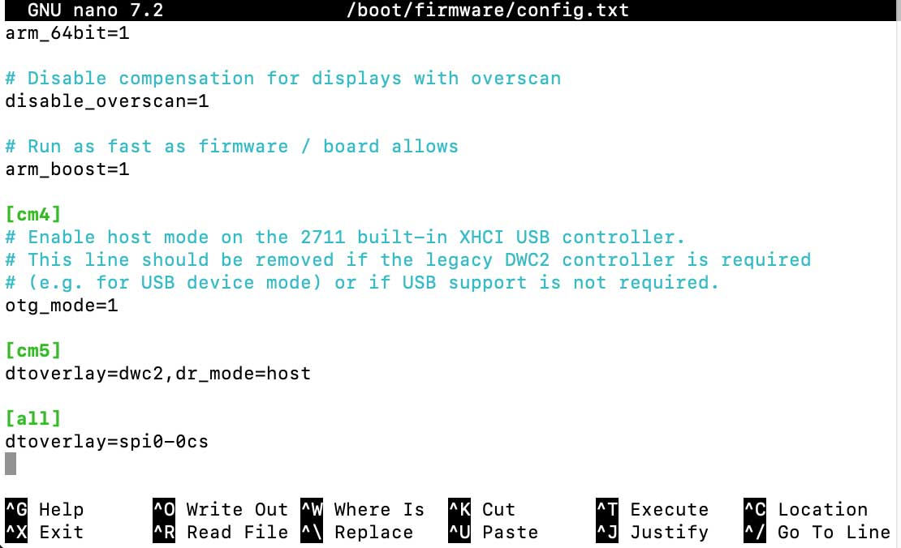

# Tick Tock Quote Clock

*Richard Baguley (with assistance from Cursor AI)*

An overly complex literary clock for the Raspberry Pi Zero 2 W and the Pimoroni Inky Impressions display. Other literary quote clocks just print out a quote. This one highlights the time part of the quote in RED!
How? Magic! Well, no, more a bit of fiddling around. Working from the list of quotes for the origional Guardian project, I sliced the quotes into three parts: the first part, the time and the second part. 
So, this quote:

>If Jill had been more used to adventures, she might have doubted the Owl’s word, but this never occurred to her; and in the exciting idea of a midnight escape she forgot her sleepiness.

Is split into this:

>If Jill had been more used to adventures, she might have doubted the Owl’s word, but this never occurred to her; and in the exciting idea of a

>midnight 

>escape she forgot her sleepiness.

The program takes the three parts and reassembles the quote, but formats each part differently, as copntrolled by the config.json file. By default, the main text is black, but the quote time is in red. 

## Installation

### 1. Install Dependencies

To install TTQC, make sure Python 3 is installed, then clone this repository 

```bash
sudo apt-get update
sudo apt-get install -y python3-pip python3-pygame
git clone https://github.com/richardtheb/TTQC
cd TTQC
```

We will also need to make a couple of small changes to the system to enable the Inky display.

```bash
sudo raspi-config nonint do_i2c 0
sudo raspi-config nonint do_spi 0
```

Next, we will need to edit a system file to change the way part of it works:

```bash
sudo nano /etc/system/config.txt
```

Scroll to the bottom of the file, and add this line to it.

```bash
dtoverlay=spi0-0cs
```

It should look like this:



Hit ctrl-X to quit and Y to save that change. Now we need to reboot the Pi to make the changes stick.


```bash
sudo restart -r now
```


Next, create the virtual environment that the program runs in, update PIP (the program that grabs other programs) and install all the other requirements,

```bash
cd TTQC
python3 -m venv venv
source venv/bin/activate
pip install --upgrade pip
pip install -r requirements.txt
```

Now we can test the Inky Impressions screen

```bash
cd TTQC
source venv/bin/activate
python stripes.py
```
Don'y worry about the messages: they are just for information. If that works, you should see a set of stripes on the Inky display, like this!


If you don't see the stripes, check out the [Pimoroni troubleshooting guide](https://github.com/pimoroni/inky). 


Finally, let's run the clock program!
```bash
python3 TTQC.py --inky
```
That will just run once and exit. When you are ready, you can make it run continuously and update every minute by adding the --interval option. 

```bash
python3 TTQC.py --inky --interval
```


### 2. Quick Start

**Option A: Single image on the Inky display**
```bash
python3 TTQC.py --Inky
```

**Option B: Continuous display (updates at the top of each minute)**
```bash
python3 TTQC.py --inky --interval
```

## Usage

### Command Line Options

```bash
# Generate image with fullscreen display
python3 TTQC.py --fullscreen

# Generate image with custom output file
python3 TTQC.py --fullscreen -o my_quote.png

# Use NTP time with fullscreen display
python3 TTQC.py --fullscreen --ntp

# Combine options
python3 TTQC.py --fullscreen --ntp --ntp-server time.google.com
```

### Continuous Display

```bash
# Run continuous display (updates at the top of each minute)
python3 TTQC.py --inky --interval
```

### Manual Control

When running manually:
- **Ctrl+C**: Stop the script

## Configuration

The display system uses the same configuration as TTQC.py:

- `config.json`: Image styling and layout settings
- `TTQC_quotes.tsv`: Quote database

### Update Interval

To change how often the display updates, change the interval: 

```bash
# Run continuous display (updates at the top of each minute). The default is 60 seconds for a 1-minute clock
python3 TTQC.py --inky --interval 120
```

## Files

- `TTQC.py`: Main script with fullscreen display and minute-based updates
- `requirements.txt`: Python dependencies
- `TTQC_quotes.tsv`: The quotes in tab seperated format, with a structure of Time, Quote_Time, Quote_Part1, Quote_Part3, Book, Author. (see the linked spreadsheet for more details.
- `config.json`: The configuration file that controls formatting, etc.

## Quotes
- The quotes file is a tab seperated values file with the following columns:

Time:         The time on HH:MM format  
Time_Quote:   The quote section that describes the time, such as "08:43" or "eight forty-three" 
Quote_Part1:  The part of the quote that precedes the time quote, such as "The clock read"
Quote_Part2:  The part of the quote that follows the time quote, such as ". A cat barked in the distance"
Book:         The title of the book
Author:       The author of the book

For more details, see the [spreadsheet I used to generate this file](https://docs.google.com/spreadsheets/d/19xWF9l6vWUVWZBSahX-jbBk1TR7CXe3ZIeYYlu96bjA/edit?usp=sharing). 


## Requirements

- Raspberry Pi with display
- Python 3.6+
- All TTQC.py dependencies, listed in requirements.txt
- X11 display server running
